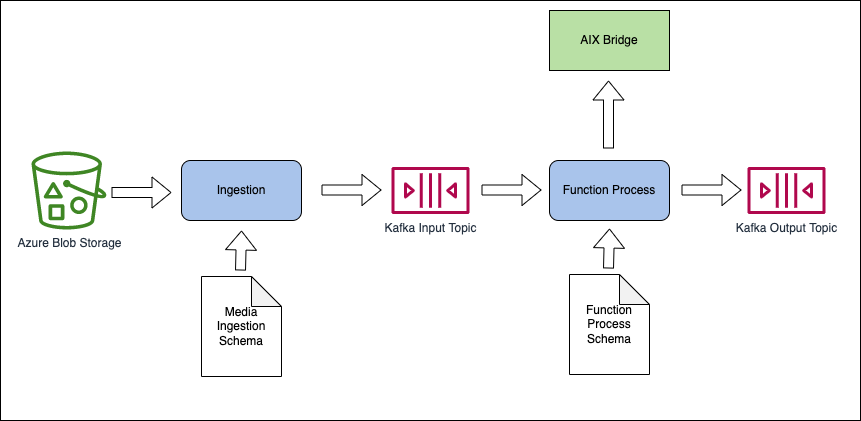
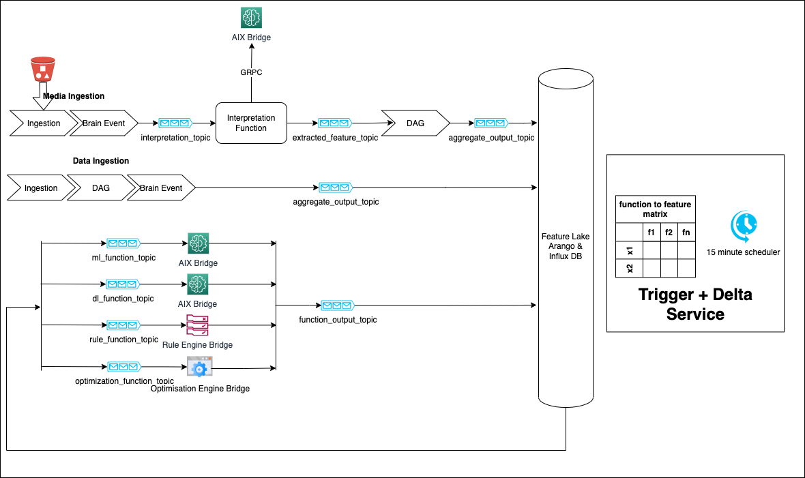
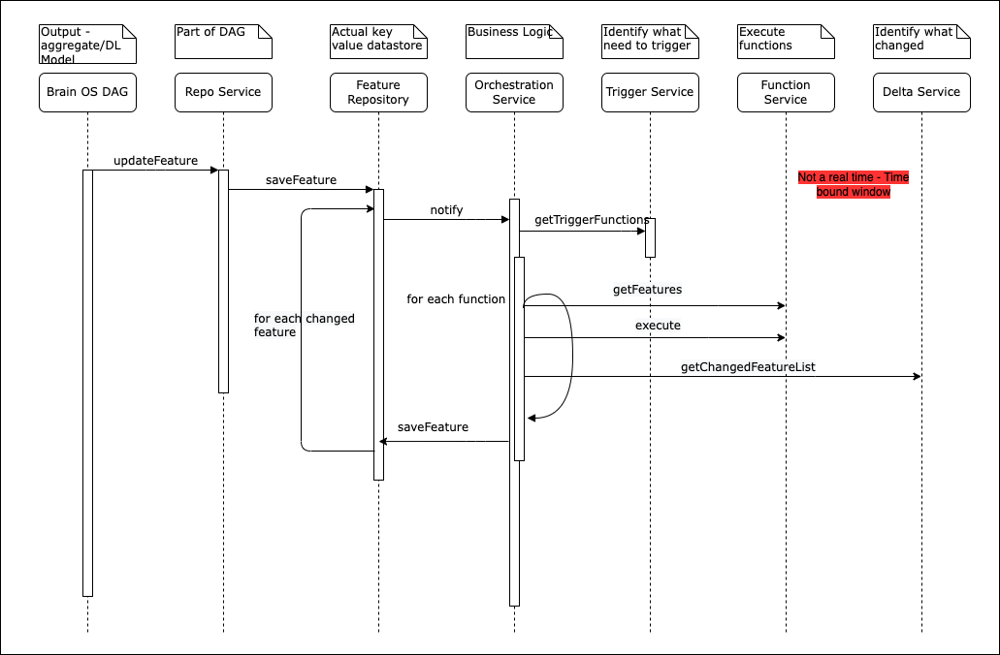
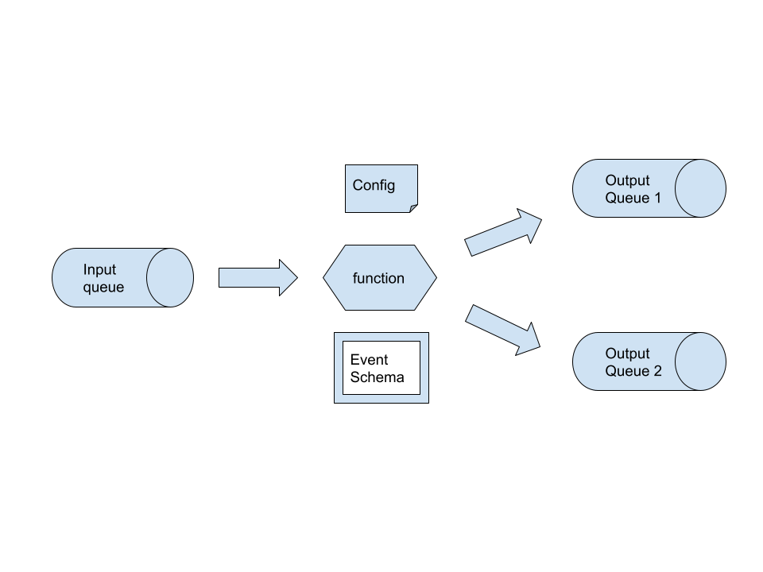
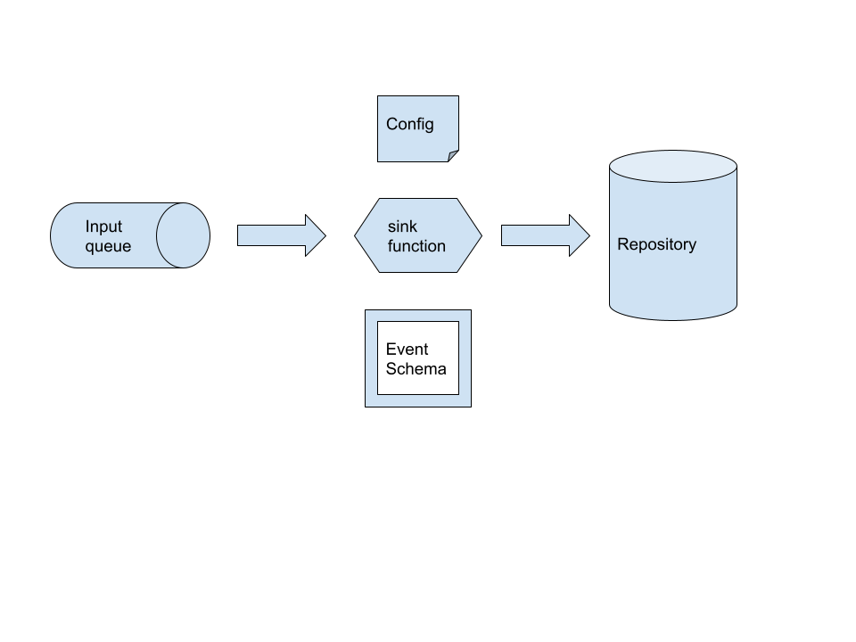
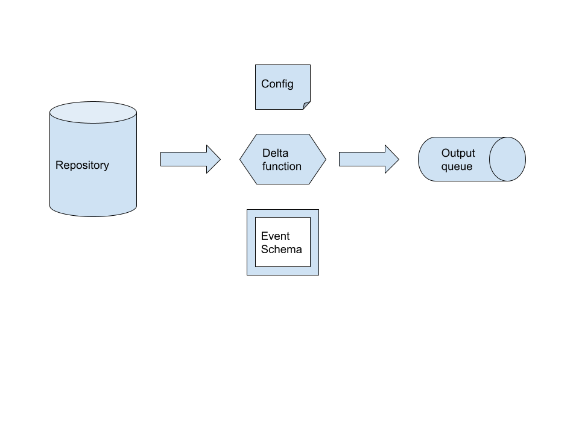
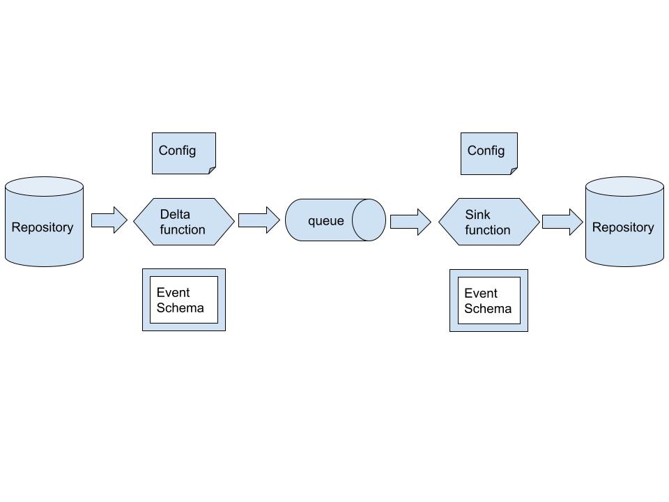

# Functions
> All function and feature name will be standardised. Feature will be defined in subsequent section. 
> They will be understood by AIX, Rule Engine, Optimization Engine and 0ML platform.

All functions take BrainEvent as input and output. 
```protobuf
service FunctionExecutionService {
  rpc serve(ExecutionRequest) returns (ExecutionResponse) {}
}
message ExecutionRequest {
  map<string, string> function_context = 1;
  jio.brain.proto.event.BrainEvent input_event = 2;
}
message ExecutionResponse {
  jio.brain.proto.base.BrainStatus status = 1;
  jio.brain.proto.event.BrainEvent output_event = 2;
}
```
## Two kind of functions
* **Interpretation functions** for feature extractions
   * Will be called from ingestion layer
   * Primarily deep learning functions
   * Take input as - Text, Image, Video or Audio content (apart from other properties)
   * Generate features as output
* **Inference functions** for inferencing, prediction, decisions and optimization
   * Will be called from feature lake
   * It can be any of below
      * Deep learning functions
      * Machine learning functions
      * Rules functions
      * Optimization functions

### Naming convention
* /function/inference/telecom/customer_estimated_usage
* /function/inference/telecom/churn_prediction
* /function/interpretation/commons/text/tweet_sentiment
* /function/interpretation/commons/speech/speech_to_text

### Deployment
Functions will be deployed as running container on kubernetes. It will be deployed similar to other services in DAG.

```protobuf
message BrainProcessSchema {
  jio.brain.proto.base.BrainToken token = 1; // function_name
  string input_topic = 2; // output of ingestion
  jio.brain.proto.event.BrainEventSchema input_event_schema = 3; 
  map<string, jio.brain.proto.event.BrainEventSchema> output_event_schema = 4; // key = output_topic, value = event key in dictionary
  oneof config {
    BrainEnrichProcessSchema enrich = 5;
    BrainFilterProcessSchema filter = 6;
    BrainPivotProcessSchema pivot = 7;
    BrainReduceProcessSchema reduce = 8;
    BrainIngestProcessSchema ingest = 9;
    BrainQuantizeProcessSchema quantize = 10;
    BrainComputeProcessSchema compute = 11;
    BrainFunctionProcessSchema function = 12;
  }
}
message BrainFunctionProcessSchema {
   jio.brain.proto.base.BrainFunctionType function_tyoe = 1;
   string output_event_schema = 2;
   string output_topic = 3;
   map<string, string> function_context = 4;
   string grpc_host = 5;
   uint32 grpc_port = 6;
}
```
## Interpretation functions
Deepl learning functions
1. They will be used for feature extraction primarily from text, image, video feed, audio input
2. They will be called from ingestion layer 
3. Examples - Tweet, Image of crop, Feed from security camera etc



### Ingestion Config
Data Ingestion and additional fields in FieldMapping Ignored
```protobuf
message BrainIngestProcessSchema {
  repeated FieldMapping mappings = 1;
  oneof data {
    BrainDataIngestionProcessSchema data_ingestion = 2; // excel, csv data
    BrainMediaIngestionProcessSchema media_ingestion = 3; // video, audio, image
  }
}
message BrainMediaIngestionProcessSchema {
   oneof data_transport {
      KafkaTransport kafka_transport = 2;
      BlobStorageTransport blob_transport = 3; // Azure blob store or S3 bucket
   }
}
message BlobStorageTransport {
   string bucket_name = 1;
   string prefix = 2;
   string suffix = 3;
}
message FieldMapping {
   string field_name = 1; // key name in case of kafka
   string column_unit = 2; // unit of this column
   jio.brain.proto.base.BrainInputDataType input_data_type = 4; // data type of input - will always be string in case of csv
   string format = 3; // date format or number format in case of date or number
   FieldType field_type = 4;
   bool is_optional = 5;
   oneof element {
      BizId entity_biz_id = 6; // camera id or user id in tweet
      BrainPropertySchema property = 7;
   }
}
```

### Ingestion Output BrainEvent
After ingestion **property_store** below will have brain media quantity embedded

Good old BrainEventValue
```protobuf
message BrainEventValue {
  BrainEntityStore entity_store = 1; // camera id, farmer id
  BrainQuantityStore property_store = 2; // media quantity, timestamp of image
  BrainAttributeStore attribute_store = 3;
  BrainEntityPredicateStore predicate_store = 4;
}
```
### Media Representation

```protobuf
message BrainQuantity {
   oneof quantity_is_one_of {
      BrainAtomicQuantity atomic = 1;
      BrainCompoundQuantity compound = 2;
      BrainTemporalQuantity temporal = 3;
      BrainSpatialQuantity spatial = 4;
      BrainMediaQuantity media = 5;
   }
}
message BrainMediaQuantity {
  oneof media_is_one_of {
    BrainTextQuantity text = 1;
    BrainDocumentQuantity document = 2;
    BrainVideoQuantity video = 3;
    BrainAudioQuantity audio = 4;
    BrainImageQuantity image = 5;
  }
}
message BrainTextQuantity {
  string encoding = 1;
  BrainLanguageType language = 2; // en, hn, sp
  BrainTextType text_type = 3; // tweet, review comment, chat
  string text = 4; // actual content
}
message BrainPayload {
   oneof payload_is_one_of {
      bytes payload = 1;
      string url = 2;
   }
}
message BrainDocumentQuantity {
  BrainDocumentType document_type = 1; // word, excel, docs
  BrainPayload payload = 2; // url or bytes
}
message BrainVideoQuantity {
  BrainVideoFormat video_format = 1; // mpeg4, mov
  BrainPayload payload = 2; // url or bytes
}
message BrainAudioQuantity {
  BrainAudioFormat audio_format = 1; // mp3, wav
  BrainPayload payload = 2; // url or bytes
}
message BrainImageQuantity {
  BrainImageFormat format = 1; // png, jpeg
  BrainPayload payload = 2; // url or bytes
}
message BrainMediaQuantitySchema {
  oneof media_is_one_of {
    BrainTextQuantitySchema text = 1;
    BrainDocumentQuantitySchema document = 2;
    BrainVideoQuantitySchema video = 3;
    BrainAudioQuantitySchema audio = 4;
    BrainImageQuantitySchema image = 5;
  }
}
message BrainTextQuantitySchema {
  BrainTextType default_text_type = 1; // tweet/chat/email
  BrainLanguageType default_language = 2; // english/hindi
  BrainTextEncoding default_encoding = 3; // utf16, utf8, ascii
}
message BrainDocumentQuantitySchema {
  BrainDocumentType default_document_type = 1; // invoice/aadhaar/pan
  BrainDocumentFormat default_document_format = 2; // pdf/word/excel
  BrainPayloadType default_payload_type = 3;
}
message BrainVideoQuantitySchema {
  BrainVideoFormat default_video_format = 1; //mpeg,mov
  BrainPayloadType default_payload_type = 2;
}
message BrainAudioQuantitySchema {
  BrainAudioFormat default_audio_format = 1; // wav,mp3
  BrainPayloadType payload_type = 2;
}
message BrainImageQuantitySchema {
  BrainImageFormat image_format = 1;
  BrainPayloadType payload_type = 2;
}
```
## Inference functions
These are functions that read BrainEvent as input from kafka topic, perform required processing and put output BrainEvent on another kafka topic. These kafka events will be consumed by
* AIX
* 0ml platform
* Rule engine
* Optimization engine
> For rest see below feature lake

# Feature Lake
Feature lake represent mapping of distinct key (entity x context) with all its related features.

## Brain Key
* It is same key as for aggregation/pivot process in Brain OS DAG
* It uniquely defined one row in feature lake. Features will be calculated/stored against this key.
* This key will also have time series values associated with same features 

```protobuf
message BrainEventKey {
  BrainEntityStore entity_store = 1;    // customer, cell-id
  BrainQuantityStore context_store = 2;  // time-stamp, lat-long
  BrainAttributeStore attribute_store = 3; // only symbolic, binned e.g. Number of dairy products sold in store
  BrainEntityPredicateStore predicate_store = 4; // Call time between Rajan and Shailesh TODO ??
  BrainTimeWindowType window_type = 5; // hour, day, week, weekend etc.
}
```
> Window type above in BrainEventKey is a feature. Example - aggregated daily vs weekly time are two distinct features.

### Key generation from BrainKey
The above BrainEventKey will be transformed to SHA256 string. It is the primary key in feature lake.
```java
String sha3Key = new DigestUtils("SHA3-256").digestAsHex(brainEventKey.toByteArray());
```

Key will be stored as human-readable form in feature lake. The UI will be built over it to look inside key.

## Brain Features
> Similar to functions, features will also be standardised and common to AIX, Rule Engine, Optimization Engine & 0ML 

### Naming convention
* /feature/telecom/daily_mute_call
* /feature/agriculture/crop_color
* /feature/retail/store_monthly_sales
* /feature/commons/text/sentiment

### Feature Config
Features will be **first** onboarded using **Brain UI Workbench.** There will four kind of features
1. Static features - Entity Attributes from Knowledge Graph. 
   1. UI will provide type ahead to search entity and its attributes.
2. Dynamic - Calculated properties in DAG (Pivot and Aggregate output). 
   1. UI will provide type ahead to search properties.
3. Extracted - Features from interpretation layer. User defined features 
4. Derived - Inferred from ML, DL, Rules Engine - User defined features

```protobuf
message BrainFeatureSchema {
  jio.brain.proto.base.BrainToken token = 1;
  jio.brain.proto.base.BrainFeatureType feature_type = 2;
  string related_type = 3;
}
```
### Features in brain event
Input and output events for functions will have features as properties. These properties can be of any below type
1. BrainAtomicQuantity - simple features (number of call drops)
2. BrainSeriesQuantity - for time series data (stock prices)
3. BrainSequenceQuantity - e.g. watch history for recommendation engine (netflix)
```protobuf
message BrainEventValue {
  BrainEntityStore entity_store = 1; 
  BrainQuantityStore property_store = 2; // features
  BrainAttributeStore attribute_store = 3;
  BrainEntityPredicateStore predicate_store = 4;
}
```
### Feature function matrix
There will be simple methods to add features to functions
1. Add feature to function
2. Remove feature from function
3. Get all features for function 

#### Function to feature mapping
```protobuf
service FunctionMetadataService {
  rpc serve(FunctionMetadataRequest) returns (FunctionMetadataResponse) {}
}
message FunctionMetadataRequest {
  string function_name = 1;
}
message FunctionMetadataResponse {
  jio.brain.proto.base.BrainStatus status = 1;
  repeated string feature_set = 2;
}
```
#### Feature to function mapping
```protobuf
service FeatureMetadataService {
  rpc serve(FeatureMetadataRequest) returns (FeatureMetadataResponse) {}
}
message FeatureMetadataRequest {
  string feature_name = 1;
}
message FeatureMetadataResponse {
  jio.brain.proto.base.BrainStatus status = 1;
  repeated string function_set = 2;
}
```


### Sequence Diagram

# Notes - Ignore below
1. Inference function config
   1. type (Grpc/URL)
   2. Input features (With names)
   3. Output features (WIth names)
2. Time series data as part of input of event
   1. Read influx to create series brain quantity for inference function (e.g. recomendation)
3. To Do
   1. Populate initial arango db attributes as features
4. Features
   1. Arango DB attributes
   2. Predicates
   3. Dynamic (Time series)
   4. DAG output
5. Type of brain quantities
   1. Series
   2. Sequence 
   3. Multivariate (Input)
## Feature Anatomy
/feature/telecom/customer_weekly_mute_calls

1. Static features - Entity Attributes from Knowledge Graph
2. Dynamic - Calculated quantities in DAG (Pivot and Aggregate output)
3. Extracted - Features from interpretation layer
4. Derived - Inferred from ML, DL, Rules Engine

### Queue to queue
#### Examples
1. Filter
2. Quantise
3. Enrich
4. Compute
5. Pivot
6. Aggregate


### Queue to Persistence Store
Sink Services

### Persistence Store to Queue
Ingestion is one kind of service

### Persistent to Persistent
This combination of two above service

### Source Function
### Sink Function
## Function Anatomy
### Queue to queue
#### Basic Functions
#### Advanced Functions
1. ML (Predictions and Inferences)
2. Rules - application of sequence quantity
3. Optimization - application of series quantity
### Queue to Persistence Store
1. Storage optimized persistence (less space) - Used to train ML model. Keep on archiving data every month
2. Database specific storage
3. Human-readable storage
### Persistence Store to Queue
### Persistent to Persistent
## Services
1. Schema Service
2. Identity Service and Link service
3. Repository Service
   1. Knowledge (Graph and time series database)
   2. Feature Lake
   3. Rule Bank
   4. Content - Text, Image, Audio, Video
   5. Model Store - Metadata (tensorflow vs sciket learn, hyper parameters, version etc.)
   6. Decision
   7. Feedback Store (Structure or Unstructured)
      1. Implicit - Clicking on Google search, watching recommended movie
      2. Explicit - Canceling Ola Cab, Click on like button
   8. Metrics
4. Inference Service
   1. Machine learning service
   2. Deep learning service
5. Ingestion - Kafka, file etc.
6. Sink service
   1. Databases - Machine readable for feature lake
   2. Databases - Human readable for dashboard and testing service
   3. Compress form - Archiving purpose and model retraining purpose
7. Rules service (Rule bank)
   1. Rules will have version
   2. Rule will family (By entity type and by action type)
   3. Rule will have priority
8. Optimization service
9. Dashboard Service 
   1. There will be a concept of id and schema.
   2. Example - engagement vs experience
   3. Data store at back for dashboard will be use case of sink service
### Pivot
Break one brain event to multiple event based on - Entity x Context
1. Customer x Store x Brand - for quantity or spent
2. Customer x Movie Genre
### Aggregate
Entity x Context x Aggregation Function x Aggregation Window
1. Entities can be multiple - 
#### Aggregation function
1. Sum
2. Max
3. Min
4. Average
5. Slope
#### Aggregation window
1. Minutes
2. Hours
3. Days (Kafka is not right)
4. Weeks (Kafka is not right)
5. Months (Kafka is not right)
## Feature Lake
### Two Processes
Execution of function changes multiple features - X(fi) = {x1, x2, x3...}

Change in feature execute multiple functions - F(xi) = {f1, f2, f3...}

1. Delta Service - What changed?
2. Trigger Service - What need to trigger?

| Features/Functions | f1 | f2  | f3  | ...  | fn |
| ------------- |:-------------:| -----:| ---  | ---  | ---  |
| x1 | Yes | Yes  | No  | ...  | No |
| x2 | No | Yes  | No  | ...  | Yes |
| x3 | Yes | Yes  | Yes  | ...  | No |
| x4 | Yes | Yes  | No  | ...  | Yes |
| x5 | Yes | Yes  | Yes  | ...  | Yes |
| x6 | Yes | No  | No  | ...  | No |

features above will correspond to Knowledge Graph and Feature Lake
### Feature Store
Three dimension structure. Below is the latest feature value. There will be depth of following matrix for different periods.

Range query is primary use case

Every 5 minutes -> Every 1 hour -> Every Day -> Every Month

| Keys          | x1            | x2  | x3  | ...  | xn |
| ------------- |:-------------:| -----:| ---  | ---  | ---  |
| entity 1 x context 1 x aggregate function 1 x aggregate window 1 | 123 | 3737 | 3726  | ...  | 5734  |
| entity 2 x context 1 x aggregate function 1 x aggregate window 1 | 4 | 46 | 456  | ...  | 5734  |
| entity 1 x context 2 x aggregate function 1 x aggregate window 1 | 48 | 76 | 895  | ...  | 5734  |
| entity 1 x context 1 x aggregate function 2 x aggregate window 1 | 123 | 3737 | 56  | ...  | 5734  |
| entity 1 x context 1 x aggregate function 1 x aggregate window 2 | 59 | 528 | 3726  | ...  | 5734  |

#### Feature families 
1. Data experience - Download throughput, Upload throughput, Latency
2. Call experience - Call drops, mute calls

### Feature change pseudocode
1. Change in feature
2. For this feature identify which functions need to executed
3. Get each function
4. For each function get all required features
5. Execute each function one by one
6. Each execution will change certain features
7. Iterate above process for each change in feature

## Repository 
### Implementation
1. Brain Entity Schema -> Database Specific Schema (One or many tables or collections)
2. Brain Entity -> Database specific one or many entities
3. Input validation services against Brain Entity Schema

## Location service
1. GIS data will remain as it is e.g. openstreet map
2. Need to assign unit64 to each entity (How to??)
3. There will parallel entities with relationship in arango db

## Identity Service
1. During on-boarding entity will have primary biz id
2. Multiple biz id can be assigned to same entity
3. Link service - to link two existing biz ids to uint64. Need to see how to manage?

## To Do
### Transaction API
### Sensor API
### Feature API
### Aggregation

Id
Payload - reference or blob
Metadata