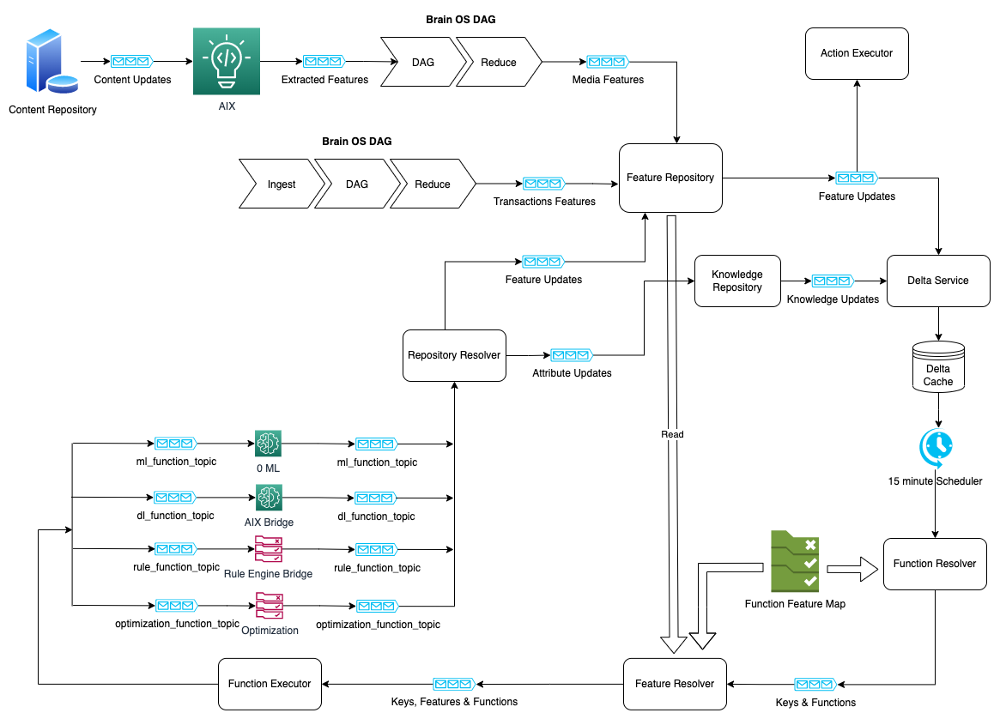

## Feature Lake

<map name="image-map">
    <area target="_blank" alt="Function Executor" title="Function Executor" href="https://www.google.com/1" coords="377,829,252,766" shape="rect">
    <area target="_blank" alt="Feature Resolver" title="Feature Resolver" href="https://www.google.com/2" coords="721,766,849,828" shape="rect">
    <area target="_blank" alt="Function Feature Map" title="Function Feature Map" href="https://www.google.com/3" coords="955,613,898,692" shape="rect">
    <area target="_blank" alt="Function Resolver" title="Function Resolver" href="https://www.google.com/4" coords="1027,625,1152,689" shape="rect">
    <area target="_blank" alt="Repository Resolver" title="Repository Resolver" href="https://www.google.com/5" coords="469,383,591,445" shape="rect">
    <area target="_blank" alt="Functions" title="Functions" href="https://www.google.com/6" coords="373,746,249,498" shape="rect">
    <area target="_blank" alt="Input Function Topics" title="Input Function Topics" href="https://www.google.com/7" coords="146,502,236,744" shape="rect">
    <area target="_blank" alt="Output Function Topics" title="Output Function Topics" href="https://www.google.com/8" coords="387,499,518,731" shape="rect">
    <area target="_blank" alt="Key, Feature, Function Topics" title="Key, Feature, Function Topics" href="https://www.google.com/9" coords="439,779,624,823" shape="rect">
    <area target="_blank" alt="Key and Function Topics" title="Key and Function Topics" href="https://www.google.com/10" coords="893,781,1019,823" shape="rect">
    <area target="_blank" alt="Content Update Topics" title="Content Update Topics" href="https://www.google.com/11" coords="98,47,212,109" shape="rect">
    <area target="_blank" alt="Interpretation Layer" title="Interpretation Layer" href="https://www.google.com/12" coords="214,22,316,120" shape="rect">
    <area target="_blank" alt="Extracted Features" title="Extracted Features" href="https://www.google.com/13" coords="324,48,428,100" shape="rect">
    <area target="_blank" alt="Media Features with Keys" title="Media Features with Keys" href="https://www.google.com/14" coords="644,52,761,101" shape="rect">
    <area target="_blank" alt="Feature Repository" title="Feature Repository" href="https://www.google.com/15" coords="713,164,851,250" shape="rect">
    <area target="_blank" alt="Knowledge Repository" title="Knowledge Repository" href="https://www.google.com/16" coords="797,292,913,361" shape="rect">
    <area target="_blank" alt="Action Executor" title="Action Executor" href="https://www.google.com/17" coords="926,27,1067,93" shape="rect">
    <area target="_blank" alt="Transaction Features" title="Transaction Features" href="https://www.google.com/18" coords="571,199,698,243" shape="rect">
    <area target="_blank" alt="Feature Updates to Repository" title="Feature Updates to Repository" href="https://www.google.com/19" coords="579,290,685,329" shape="rect">
    <area target="_blank" alt="Feature Updates  for Delta Service" title="Feature Updates  for Delta Service" href="https://www.google.com/20" coords="938,187,1053,237" shape="rect">
    <area target="_blank" alt="Attribute Updates for Delta Service" title="Attribute Updates for Delta Service" href="https://www.google.com/21" coords="608,394,723,443" shape="rect">
    <area target="_blank" alt="Knowledge Update for Delta Service" title="Knowledge Update for Delta Service" href="https://www.google.com/22" coords="918,310,1022,357" shape="rect">
    <area target="_blank" alt="Delta Service" title="Delta Service" href="https://www.google.com/23" coords="1028,291,1158,357" shape="rect">
    <area target="_blank" alt="Delta Cache" title="Delta Cache" href="https://www.google.com/24" coords="1053,392,1132,461" shape="rect">
    <area target="_blank" alt="Scheduler" title="Scheduler" href="https://www.google.com/25" coords="1043,496,1148,566" shape="rect">
    <area target="_blank" alt="DAG Interpretation Layer" title="DAG Interpretation Layer" href="https://www.google.com/26" coords="433,33,636,110" shape="rect">
    <area target="_blank" alt="DAG Transaction Layer" title="DAG Transaction Layer" href="https://www.google.com/27" coords="266,167,557,250" shape="rect">
</map>

